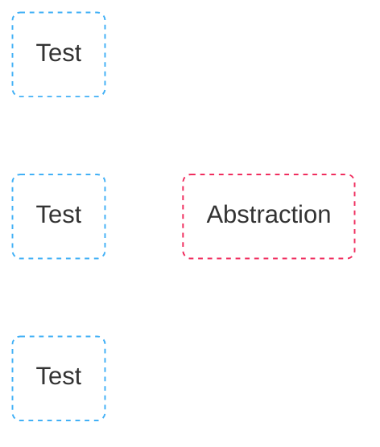

# Test design

test:
```js {*|3}
it('opens menu', () => {
  cy.visit('/')
  cy.openMenu()
})
```
custom command:
```js
Cypress.Command.add('openMenu', () => {
  cy.get('[data-test="menu"]')
    .click()
    .find('[data-test="menu-item"]')
    .click()
})
```

::right::
<div class="grid items-center h-full">

</div>

<style>
  .two-columns {
  gap: 1rem;
  grid-template-columns: 5fr 3fr !important;
}
</style>

<!--
- **three dot button** opens a menu
- sequence of actions that might occur multiple times in our test suite, we want to be DRY, let’s abstract
- [click] so we create a custom command to abstract it
- so far so good, but then
-->

---
layout: two-cols
---
# Test design

test:
```js {*|3}
it('opens menu', () => {
  cy.visit('/')
  cy.openMenu("Delete board")
})
```

custom command:
```js {*|1,5}{at:1}
Cypress.Command.add('openMenu', (item) => {
  cy.get('[data-test="menu"]')
    .click()
    .find('[data-test="menu-item"]')
    .contains(item)
    .click()
})
```

::right::
<div class="grid items-center h-full">

</div>

<style>
  .two-columns {
  gap: 1rem;
  grid-template-columns: 5fr 3fr !important;
}
</style>

<!-- 
- we have multiple items
- [click]
- so to keep this abstraction we add a parameter so that we can pass the name of the item we want to pick from menu
 -->

---
layout: two-cols
---

# Test design

test:
```js {*|3}
it('opens menu', () => {
  cy.visit('/')
  cy.openMenu("Delete board", true)
})
```

custom command:

```js {*|1|2|1-3}{at:1}
Cypress.Command.add('openMenu', (item, isList = false) => {
  const area = isList ? '[data-test="list-area"]' : '[data-test="header"]'
  cy.get(`${area} [data-test="menu"]`)
    .click()
    .find('[data-test="menu-item"]')
    .contains(item)
    .click()
})
```

::right::
<div class="grid items-center h-full">

</div>

<style>
  .two-columns {
  gap: 1rem;
  grid-template-columns: 5fr 3fr !important;
}
</style>

<!--
- but now we are introduced to another problem, because the menu component can actually be used for the main panel or in the todo lists
- [click] so we introduce a condition that will enable us to decide which menu we want to click 
- based on that condition [click]
- we fill the selector [click]
- we pass it into get command
-->

---
layout: two-cols
---

# Test design

test:
```js {*|3}
it('opens menu', () => {
  cy.visit('/')
  cy.openMenu("Delete board", true, 0)
})
```

custom command:

```js {*|1,4|*}{at:1}
Cypress.Command.add('openMenu', (item, isList = false, index = 0) => {
  const area = isList ? '[data-test="list-area"]' : '[data-test="header"]'
  cy.get(`${area} [data-test="menu"]`)
    .eq(index)
    .click()
    .find('[data-test="menu-item"]')
    .contains(item)
    .click()
})
```

::right::
<div class="grid items-center h-full">

</div>

<style>
  .two-columns {
  gap: 1rem;
  grid-template-columns: 5fr 3fr !important;
}
</style>

<!--
- And now we get to another problem, because there can be multiple todo lists
- [click] so we add an index number
- [click] when we now look at our custom command it has gotten way too complicated and we should probably refactor it
- by this time, our abstraction has become incredibely complex
-->

---
layout: two-cols
---

# Test design
```js
it('opens menu', () => {
  cy.visit('/')
  cy.openMenu()
})
```
::right::



<style>
.two-columns {
  gap: 1rem;
  grid-template-columns: 3fr 5fr !important;
}

.slidev-code-wrapper {
  padding-top: 35%
}
</style>

<!--
- but refactoring will now be a problem
- because we have all these tests using our abstraction
-->

---
layout: two-cols
---

# Test design
```js
it('opens menu', () => {
  cy.visit('/')
  cy.openMenu()
})
```
::right::


<style>
.two-columns {
  gap: 1rem;
  grid-template-columns: 3fr 5fr !important;
}

.slidev-code-wrapper {
  padding-top: 35%
}
</style>

<!--
- but when we change the abstraction, it’s going to affect all our tests

- so why am I talking about this?
- as your project will scale, these kind of situations may start happening more often, and they are going to get harder to mitigate
- so when we talk about test design with the mindset of scaling the project, it’s really worth to be aware of what is an industry "good practice" and what is actually a good practice for your project
- because as we just demonstrated a seemingly good practice has the potential to turn into a nightmare
-->
